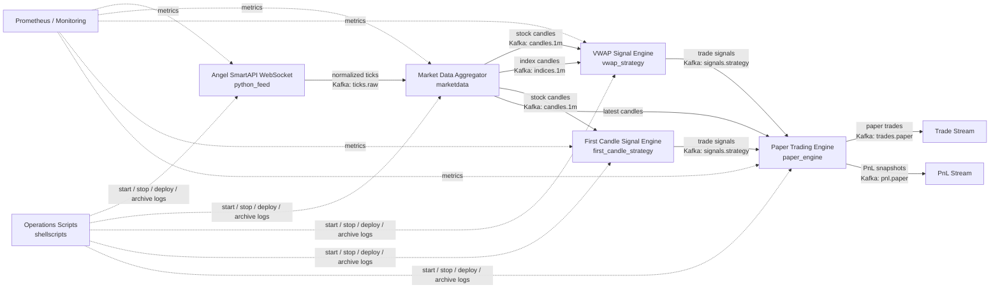
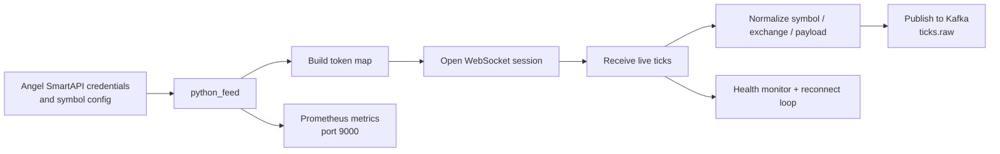
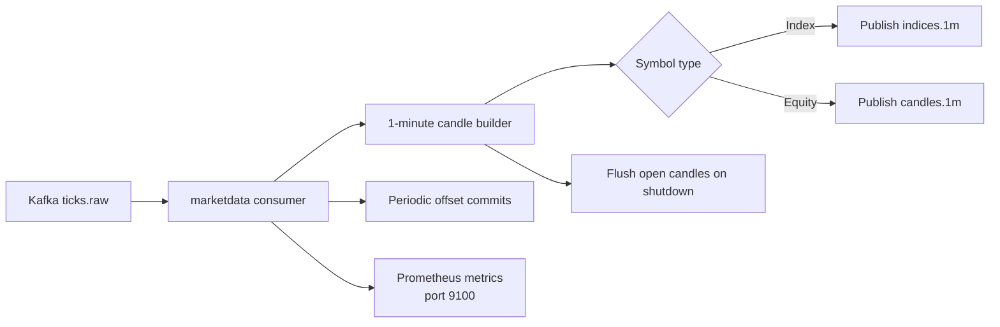
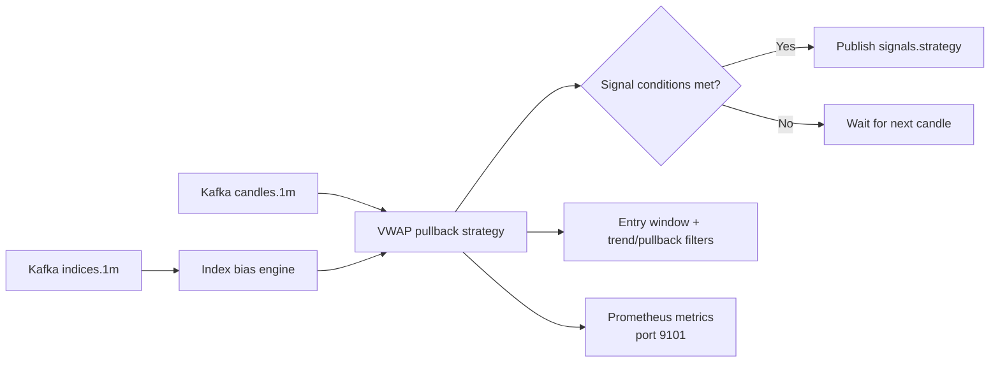
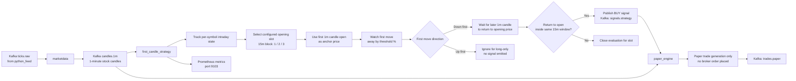
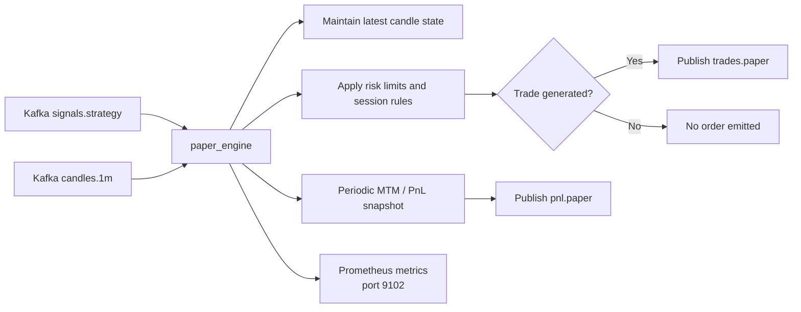

# TradingArchitecture Application Flow

## End-to-End Flow

```mermaid
flowchart LR
    A["Angel SmartAPI WebSocket<br/>python_feed"] -->|normalized ticks<br/>Kafka: ticks.raw| B["Market Data Aggregator<br/>marketdata"]
    B -->|stock candles<br/>Kafka: candles.1m| C["VWAP Signal Engine<br/>vwap_strategy"]
    B -->|index candles<br/>Kafka: indices.1m| C
    B -->|stock candles<br/>Kafka: candles.1m| D["First Candle Signal Engine<br/>first_candle_strategy"]
    C -->|trade signals<br/>Kafka: signals.strategy| E["Paper Trading Engine<br/>paper_engine"]
    D -->|trade signals<br/>Kafka: signals.strategy| E
    B -->|latest candles| E
    E -->|paper trades<br/>Kafka: trades.paper| F["Trade Stream"]
    E -->|PnL snapshots<br/>Kafka: pnl.paper| G["PnL Stream"]

    H["Prometheus / Monitoring"] -.metrics.-> A
    H -.metrics.-> B
    H -.metrics.-> C
    H -.metrics.-> D
    H -.metrics.-> E

    I["Operations Scripts<br/>shellscripts"] -.start / stop / deploy / archive logs.-> A
    I -.start / stop / deploy / archive logs.-> B
    I -.start / stop / deploy / archive logs.-> C
    I -.start / stop / deploy / archive logs.-> D
    I -.start / stop / deploy / archive logs.-> E
```

## Application-Level Flows

### python_feed

```mermaid
flowchart LR
    A["Angel SmartAPI credentials<br/>and symbol config"] --> B["python_feed"]
    B --> C["Build token map"]
    C --> D["Open WebSocket session"]
    D --> E["Receive live ticks"]
    E --> F["Normalize symbol / exchange / payload"]
    F --> G["Publish to Kafka<br/>ticks.raw"]
    E --> H["Health monitor + reconnect loop"]
    B --> I["Prometheus metrics<br/>port 9000"]
```

### marketdata

```mermaid
flowchart LR
    A["Kafka ticks.raw"] --> B["marketdata consumer"]
    B --> C["1-minute candle builder"]
    C --> D{"Symbol type"}
    D -->|Index| E["Publish indices.1m"]
    D -->|Equity| F["Publish candles.1m"]
    B --> G["Periodic offset commits"]
    C --> H["Flush open candles on shutdown"]
    B --> I["Prometheus metrics<br/>port 9100"]
```

### vwap_strategy

```mermaid
flowchart LR
    A["Kafka indices.1m"] --> B["Index bias engine"]
    C["Kafka candles.1m"] --> D["VWAP pullback strategy"]
    B --> D
    D --> E{"Signal conditions met?"}
    E -->|Yes| F["Publish signals.strategy"]
    E -->|No| G["Wait for next candle"]
    D --> H["Entry window + trend/pullback filters"]
    D --> I["Prometheus metrics<br/>port 9101"]
```

### first_candle_strategy

```mermaid
flowchart LR
    A["Kafka ticks.raw<br/>from python_feed"] --> B["marketdata"]
    B --> C["Kafka candles.1m<br/>1-minute stock candles"]
    C --> D["first_candle_strategy"]

    D --> E["Track per-symbol intraday state"]
    E --> F["Select configured opening slot<br/>15m block: 1 / 2 / 3"]
    F --> G["Use first 1m candle open<br/>as anchor price"]
    G --> H["Watch first move<br/>away by threshold %"]
    H --> I{"First move direction"}
    I -->|Down first| J["Wait for later 1m candle<br/>to return to opening price"]
    I -->|Up first| K["Ignore for long-only<br/>no signal emitted"]
    J --> L{"Return to open<br/>inside same 15m window?"}
    L -->|Yes| M["Publish BUY signal<br/>Kafka: signals.strategy"]
    L -->|No| N["Close evaluation for slot"]

    M --> O["paper_engine"]
    C --> O
    O --> P["Paper trade generation only<br/>no broker order placed"]
    P --> Q["Kafka: trades.paper"]

    D --> R["Prometheus metrics<br/>port 9103"]
```

### paper_engine

```mermaid
flowchart LR
    A["Kafka signals.strategy"] --> B["paper_engine"]
    C["Kafka candles.1m"] --> B
    B --> D["Maintain latest candle state"]
    B --> E["Apply risk limits and session rules"]
    E --> F{"Trade generated?"}
    F -->|Yes| G["Publish trades.paper"]
    F -->|No| H["No order emitted"]
    B --> I["Periodic MTM / PnL snapshot"]
    I --> J["Publish pnl.paper"]
    B --> K["Prometheus metrics<br/>port 9102"]
```
